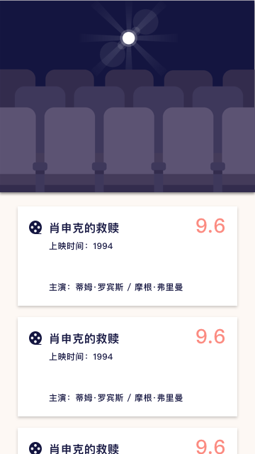
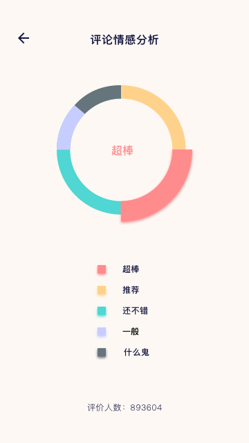

# Douby

## Brief introduction
Douby is the application which follows Material Design and filters movies by rating.
What's more, the results by analyzing emotions from comments is provided.

## Open source project want to practice
+ [RxJava](https://github.com/ReactiveX/RxJava)    
+ [Retrofit](https://github.com/square/retrofit)  
+ [OkHttp](https://github.com/square/okhttp)
+ [Fresco](https://github.com/facebook/fresco)  
+ [Glide](https://github.com/bumptech/glide)
+ [Realm](https://github.com/realm/realm-java)

## Screenshots
  

## Thanks
[douban](https://developers.douban.com/wiki/?title=api_v2)